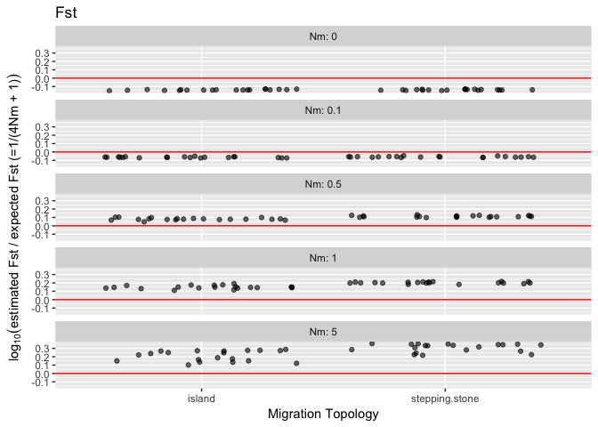

Simulated Data Summary, version 2
=================================

    2017-04-09

The data was generated with a fastsimcoal simulation that created allele frequencies at equilibrium and were then used to initialize and run 3 generations of an rmetasim simulation.

Scenario parameters
-------------------

The scenarios were composed of the following parameter combinations:

       scenario  Ne  Nm theta       mig.type num.loci num.pops div.time
    1         1  50 0.0   0.2         island     1000        5    25000
    2         2 500 0.0   0.2         island     1000        5    25000
    3         3  50 0.5   0.2         island     1000        5    25000
    4         4 500 0.5   0.2         island     1000        5    25000
    5         5  50 1.0   0.2         island     1000        5    25000
    6         6 500 1.0   0.2         island     1000        5    25000
    7         7  50 5.0   0.2         island     1000        5    25000
    8         8 500 5.0   0.2         island     1000        5    25000
    9         9  50 0.0   0.2 stepping.stone     1000        5    25000
    10       10 500 0.0   0.2 stepping.stone     1000        5    25000
    11       11  50 0.5   0.2 stepping.stone     1000        5    25000
    12       12 500 0.5   0.2 stepping.stone     1000        5    25000
    13       13  50 1.0   0.2 stepping.stone     1000        5    25000
    14       14 500 1.0   0.2 stepping.stone     1000        5    25000
    15       15  50 5.0   0.2 stepping.stone     1000        5    25000
    16       16 500 5.0   0.2 stepping.stone     1000        5    25000
       mut.rate mig.rate
    1     1e-03    0.000
    2     1e-04    0.000
    3     1e-03    0.010
    4     1e-04    0.001
    5     1e-03    0.020
    6     1e-04    0.002
    7     1e-03    0.100
    8     1e-04    0.010
    9     1e-03    0.000
    10    1e-04    0.000
    11    1e-03    0.010
    12    1e-04    0.001
    13    1e-03    0.020
    14    1e-04    0.002
    15    1e-03    0.100
    16    1e-04    0.010

The "island" model specifies a migration matrix such as the following from scenario 3, where the migration rate for a population is 0.01 split among the other 4 populations:

         [,1] [,2] [,3] [,4] [,5]
    [1,] 0.96 0.01 0.01 0.01 0.01
    [2,] 0.01 0.96 0.01 0.01 0.01
    [3,] 0.01 0.01 0.96 0.01 0.01
    [4,] 0.01 0.01 0.01 0.96 0.01
    [5,] 0.01 0.01 0.01 0.01 0.96

The "stepping.stone" model specifies a migration matrix such as the following from scenario 15, where the migration rate for a population is 0.1 split between the neighboring two populations:

         [,1] [,2] [,3] [,4] [,5]
    [1,]  0.8  0.1  0.0  0.0  0.1
    [2,]  0.1  0.8  0.1  0.0  0.0
    [3,]  0.0  0.1  0.8  0.1  0.0
    [4,]  0.0  0.0  0.1  0.8  0.1
    [5,]  0.1  0.0  0.0  0.1  0.8

Files
-----

All output files are contained in the folder "v\#.sim.data". Each scenario has gtypes objects stored in a R workspace file, named "v\#.gtypes.sc.rdata" where "sc" is the scenario number. This file contains two objects:

-   `fsc.list` - A list of gtypes from fastsimcoal, one per replicate. The scenario parameters are stored as a one row data.frame in `attr(fsc.list, "params")`.
-   `rms.list` - A list of gtypes from rmetasim after initialization with the corresponding gtypes object from `fsc.list`. This contains the final genotypes. The scenario parameters are also stored as a one row data.frame in `attr(rms.list, "params")`.

Diagnostics
-----------

    `stat_bin()` using `bins = 30`. Pick better value with `binwidth`.

