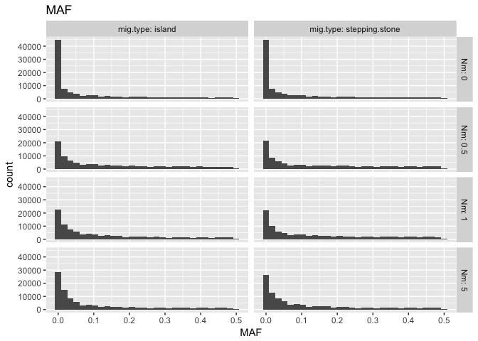
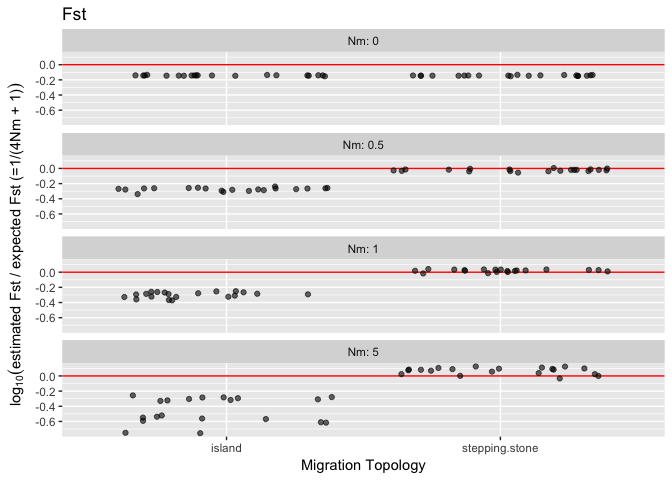
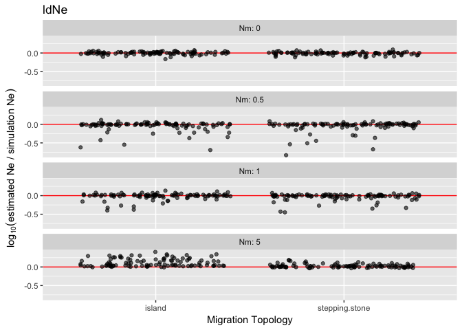

Simulated Data Summary, version 5
=================================

    2016-12-29

The data was generated with a fastsimcoal simulation that created allele frequencies at equilibrium and were then used to initialize and run 5 generations of an rmetasim simulation.

Scenario parameters
-------------------

The scenarios were composed of the following parameter combinations:

       scenario  Ne Nm theta       mig.type num.loci num.pops div.time
    1         1  50  0  0.10         island     1000        5    50000
    2         2 500  0  0.10         island     1000        5    50000
    3         3  50  1  0.10         island     1000        5    50000
    4         4 500  1  0.10         island     1000        5    50000
    5         5  50  5  0.10         island     1000        5    50000
    6         6 500  5  0.10         island     1000        5    50000
    7         7  50  0  0.25         island     1000        5    50000
    8         8 500  0  0.25         island     1000        5    50000
    9         9  50  1  0.25         island     1000        5    50000
    10       10 500  1  0.25         island     1000        5    50000
    11       11  50  5  0.25         island     1000        5    50000
    12       12 500  5  0.25         island     1000        5    50000
    13       13  50  0  0.10 stepping.stone     1000        5    50000
    14       14 500  0  0.10 stepping.stone     1000        5    50000
    15       15  50  1  0.10 stepping.stone     1000        5    50000
    16       16 500  1  0.10 stepping.stone     1000        5    50000
    17       17  50  5  0.10 stepping.stone     1000        5    50000
    18       18 500  5  0.10 stepping.stone     1000        5    50000
    19       19  50  0  0.25 stepping.stone     1000        5    50000
    20       20 500  0  0.25 stepping.stone     1000        5    50000
    21       21  50  1  0.25 stepping.stone     1000        5    50000
    22       22 500  1  0.25 stepping.stone     1000        5    50000
    23       23  50  5  0.25 stepping.stone     1000        5    50000
    24       24 500  5  0.25 stepping.stone     1000        5    50000
       mut.rate mig.rate
    1  0.000500    0.000
    2  0.000050    0.000
    3  0.000500    0.020
    4  0.000050    0.002
    5  0.000500    0.100
    6  0.000050    0.010
    7  0.001250    0.000
    8  0.000125    0.000
    9  0.001250    0.020
    10 0.000125    0.002
    11 0.001250    0.100
    12 0.000125    0.010
    13 0.000500    0.000
    14 0.000050    0.000
    15 0.000500    0.020
    16 0.000050    0.002
    17 0.000500    0.100
    18 0.000050    0.010
    19 0.001250    0.000
    20 0.000125    0.000
    21 0.001250    0.020
    22 0.000125    0.002
    23 0.001250    0.100
    24 0.000125    0.010

The "island" model specifies a migration matrix such as the following from scenario 3, where the migration rate for a population is 0.02 split among the other 4 populations:

          [,1]  [,2]  [,3]  [,4]  [,5]
    [1,] 0.980 0.005 0.005 0.005 0.005
    [2,] 0.005 0.980 0.005 0.005 0.005
    [3,] 0.005 0.005 0.980 0.005 0.005
    [4,] 0.005 0.005 0.005 0.980 0.005
    [5,] 0.005 0.005 0.005 0.005 0.980

The "stepping.stone" model specifies a migration matrix such as the following from scenario 15, where the migration rate for a population is 0.02 split between the neighboring two populations:

         [,1] [,2] [,3] [,4] [,5]
    [1,] 0.98 0.01 0.00 0.00 0.01
    [2,] 0.01 0.98 0.01 0.00 0.00
    [3,] 0.00 0.01 0.98 0.01 0.00
    [4,] 0.00 0.00 0.01 0.98 0.01
    [5,] 0.01 0.00 0.00 0.01 0.98

Files
-----

All output files are contained in the folder "v\#.sim.data". The files are labelled as follows:

-   v\#.fsc.\#\#.rdata - contains one object, `fsc.list`, which is a list containing one gtypes object for each fastsimcoal replicate for the scenario given in \#\# in the filename. `fsc.list` has an `params` attribute (`attr(fsc.list, "params")`) which is a one row data.frame with the parameters for the scenario that generated the replicates.
-   v\#.rms.\#\#.rdata - contains two objects, `fsc.list` as above and `rms.list` which is a list of gtypes objects generated by rmetasim runs on each of the fastsimcoal replicates in `fsc.list`. This is the "final" set of genotypes to be used for analyses. `attr(rms.list, "params")` contains a list of the parameters for the scenario rather than a one row data.frame.
-   v\#.smry.\#\#.rdata - contains one object, `smry`, which is a matrix containing summary diagnostics of Ne, Fst, observed heterozygosity, theta, and minimum allele frequency for each replicate as defined below.

Simulated data diagnostics
--------------------------

Below are diagnostic values from the final datasets generated from fastsimcoal and rmetasim. Ten replicates of the above scenarios were run through fastsimcoal, and the resulting allele frequencies were used to initialize a single run of rmetasim for 5 generations.

-   Ne (est.Ne) is the harmonic mean of estimated Ne calculated with the `ldNe` function in strataG with a MAF cutoff of 0.05.
-   Fst (est.Fst) is estimated with Weir and Cockerhams Fst from the `statFst` function in strataG. The value shown is the Fst value from the global test of differentiation for all 5 populations.
-   Observed Heterozygosity (obs.Het) is the mean value for all loci in all populations (n = 5000 loci).
-   Theta (est.Theta) is estimated with theta based on heterozygosity from the `theta.h` function in pegas (called by the `theta` function in strataG). The value is mean value for all loci in all populations (n = 5000 loci).
-   MAF is the mean minimum allele frequency for all loci in all populations (n = 5000 loci).

<!-- -->

    Loading required package: apex

    Loading required package: ape

    Loading required package: phangorn

    Loading required package: adegenet

    Loading required package: ade4

       /// adegenet 2.0.2 is loaded ////////////

       > overview: '?adegenet'
       > tutorials/doc/questions: 'adegenetWeb()' 
       > bug reports/feature requests: adegenetIssues()

